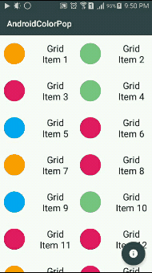

AndroidColorPop
===============

A library to show a color pop in a new fragment based on position of clicked view. 

  

It uses simple draw calls so it can be used in API 7+.

Dependencies
------

Library Project :
```
Android Support v7 Appcompat
NineOldAndroids 2.4.0
```

Sample Project :
```
Android Support Design
```

Simple Usage
------

Preparing the second fragment to be added in onClick void :
```java
		view.setOnClickListener(new OnClickListener() {

			@Override
			public void onClick(View v) {
				SecondFragment fragment = new SecondFragment();
				// used to inform the second fragment
				FragmentInformer informer = new FragmentInformer(getContext());
				// color of the cricle
				informer.setCircleColor(color);
				// if your views are behind status bar set this to true (Used In API 19+)
				boolean is_views_behind_status_bar = false;
				// the base view that the start point of color pop would be exactly center of that
				// view if mode is set to FragmentInformer.MODE_CENTER
				informer.setBaseView(v, FragmentInformer.MODE_CENTER,
						is_views_behind_status_bar);
				//finally inform the fragment with this call
				informer.informColorPopFragment(fragment);
			    //Fragment transaction
				FragmentTransaction transaction = getSupportFragmentManager().beginTransaction();
				transaction.addToBackStack(null);
				transaction.add(android.R.id.content, fragment);
				transaction.commit();
			}
		});
```

SecondFragment.java :
```java 

// note that your class must extend ColorPopFragment or ColorPopPageFragment (which have a different usage)
public class SecondFragmentList extends ColorPopFragment{
    // the base view of fragment
	private View fragment_view;
	
	// this void is called after onCreateView in fragment
	// Note : the visibility of returned view in this method would be set to INVISIBLE
	@Override
	public View onCreateFragmentView(LayoutInflater inflater,
			ViewGroup container, Bundle savedInstanceState) {
		fragment_view = inflater.inflate(R.layout.fragment_second_list,
				container, false);
		return fragment_view;
	}
	// called after the pop animation ends
	@Override
	public void onBackgroundAnimationEnd() {
	    // set visibility of fragment_view to VISIBLE
		fragment_view.setVisibility(View.VISIBLE);
	}
}
```
License
-------

    Copyright 2016 Mahdi Fallahi

    Licensed under the Apache License, Version 2.0 (the "License");
    you may not use this file except in compliance with the License.
    You may obtain a copy of the License at

        http://www.apache.org/licenses/LICENSE-2.0

    Unless required by applicable law or agreed to in writing, software
    distributed under the License is distributed on an "AS IS" BASIS,
    WITHOUT WARRANTIES OR CONDITIONS OF ANY KIND, either express or implied.
    See the License for the specific language governing permissions and
    limitations under the License.
